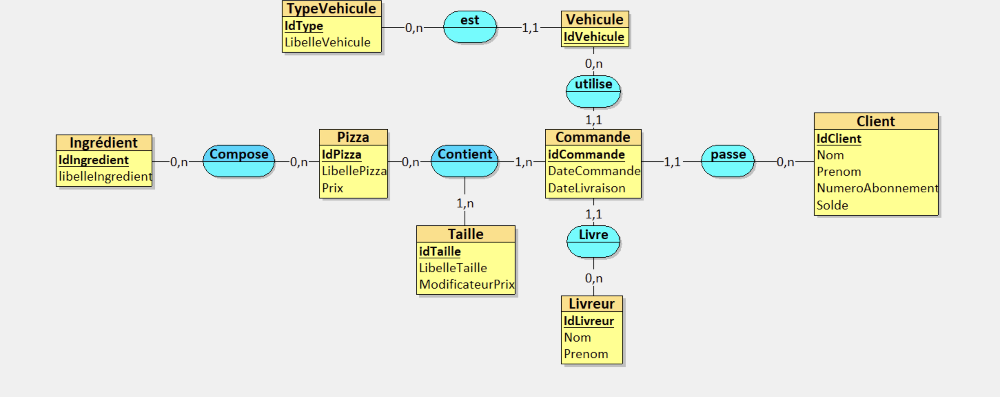
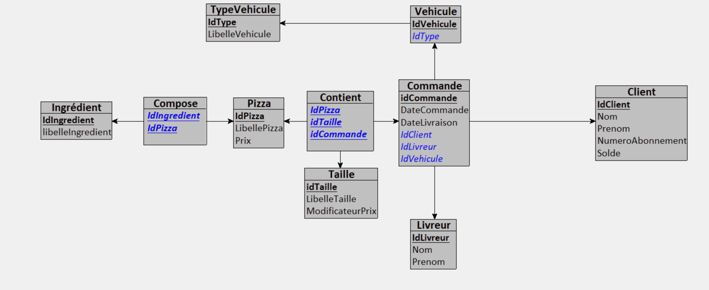

# RaPizz

## Présentation du Projet

### Projet : Gestion d'une entreprise de pizzas à domicile - RaPizz

### Contexte
Le projet "RaPizz" a pour objectif de modéliser et de gérer les opérations d'une entreprise de fabrication et de livraison de pizzas à domicile. RaPizz est une société en franchise qui propose un catalogue de pizzas aux compositions et formats standardisés. Les clients choisissent parmi les pizzas disponibles sans possibilité de personnalisation.

### Produits
Les produits principaux vendus par RaPizz sont des pizzas. Chaque pizza est définie par :
- **Nom**
- **Ingrédients**
- **Prix de base**

Pour chaque pizza, trois tailles sont disponibles :
- **Naine** : 1/3 moins chère que le prix de base
- **Humaine** : prix de base
- **Ogresse** : 1/3 plus chère que le prix de base

### Mode de Distribution
Les pizzas sont livrées par des livreurs utilisant des voitures ou des motos. Les livreurs n'ont pas de véhicules attitrés. La base de données permet le suivi de l'activité des livreurs et des véhicules utilisés.

### Modalités de Vente
RaPizz utilise un système de vente prépayé. Les clients doivent s'abonner et approvisionner leur compte avant de passer une commande. La vérification du solde du compte est effectuée avant la préparation et la livraison des commandes. Deux systèmes de bonification sont en place :
- Une pizza gratuite après l'achat de 10 pizzas.
- Toute pizza livrée en plus de 30 minutes est gratuite.

### Objectifs du Système
Le système vise à gérer les activités quotidiennes de vente et de livraison de pizzas, incluant :
- Vérification du solde du compte client et facturation.
- Suivi du chiffre d'affaires.
- Refus des commandes avec solde insuffisant.
- Gestion des pizzas gratuites pour cause de retard ou fidélité.

Le système permet également de générer diverses statistiques telles que :
- Identification du meilleur client.
- Identification du plus mauvais livreur et du véhicule utilisé.
- Identification de la pizza la plus ou la moins demandée.
- Identification de l'ingrédient favori.

## Comment démarrer le projet ? 💫

### Prérequis
- **Java 21** (ou version supérieure)
- **IntelliJ IDEA** (ou tout autre IDE compatible)
- **MySQL** (ou tout autre système de gestion de base de données relationnelle)
- **JavaFX SDK** (pour les interfaces graphiques avec JavaFX)
- **SceneBuilder** (optionnel, pour faciliter la création de fichiers FXML)
- **Maven** (pour la gestion des dépendances et la construction du projet)

### Étapes d'installation

1. **Ouvrir le projet avec IntelliJ IDEA**
   - Ouvrez IntelliJ IDEA.
   - Sélectionnez `File` > `Open...` et naviguez jusqu'au dossier `./RaPizzApp`. Sélectionnez ce dossier et ouvrez-le.

2. **Configurer le JDK**
   - Si vous n'avez pas Java 21, IntelliJ IDEA vous proposera de le télécharger. Suivez les instructions pour l'installer.
   - Assurez-vous que le projet utilise bien Java 21. Allez dans `File` > `Project Structure` > `Project` et vérifiez que le SDK est bien configuré sur Java 21.

3. **Installer JavaFX (si nécessaire)**
   - Si vous avez des erreurs de compilation ou que JavaFX n'est pas installé, téléchargez le SDK de JavaFX depuis [Gluon](https://gluonhq.com/products/javafx/).
   - Ajoutez JavaFX dans les librairies du projet :
     - Allez dans `File` > `Project Structure` > `Libraries`.
     - Cliquez sur `+` pour ajouter une nouvelle bibliothèque.
     - Sélectionnez le dossier où vous avez extrait JavaFX SDK.

4. **Configurer la base de données**
   - Ouvrez le fichier `DatabaseHandler.java`.
   - Modifiez les informations de connexion à votre base de données (login, mot de passe, URL).

5. **Lancer le projet**
   - Une fois toutes les configurations faites, vous pouvez lancer le projet en exécutant la classe principale.

6. **Configurer MySQL avec IntelliJ IDEA**
   - Pour connecter IntelliJ IDEA à votre base de données MySQL, suivez [ce tutoriel](https://www.jetbrains.com/help/idea/connecting-to-a-database.html#connect-to-mysql).
   - Ajoutez une nouvelle connexion de base de données dans IntelliJ IDEA et renseignez les détails de connexion.

7. **Installer SceneBuilder (optionnel)**
   - Pour faciliter la création de fichiers FXML, téléchargez et installez SceneBuilder depuis [Gluon](https://gluonhq.com/products/scene-builder/).
   - Vous pouvez intégrer SceneBuilder avec IntelliJ IDEA en suivant [ce guide](https://www.jetbrains.com/help/idea/javafx.html#open-fxml-scene-builder).

## Technologies Utilisées

### Langages et Frameworks
- **Java 21** : Le langage principal utilisé pour le développement de l'application. Java offre une robustesse et une sécurité accrues, essentielles pour une application de gestion d'entreprise.
- **JavaFX** : Utilisé pour créer l'interface utilisateur graphique (GUI). JavaFX permet de concevoir des interfaces modernes et réactives.

### Outils de Développement
- **IntelliJ IDEA** : L'IDE principal utilisé pour écrire, tester et déboguer le code. IntelliJ IDEA offre de nombreuses fonctionnalités qui facilitent le développement Java, notamment l'intégration avec JavaFX et les outils de gestion de bases de données.
- **SceneBuilder** : Utilisé en complément de JavaFX pour créer des fichiers FXML. SceneBuilder facilite la conception visuelle des interfaces graphiques.
- **Maven** : Utilisé pour la gestion des dépendances et la construction du projet. Maven simplifie le processus de configuration du projet et assure que toutes les bibliothèques nécessaires sont disponibles.

### Gestion de Bases de Données
- **MySQL** : Système de gestion de bases de données relationnelles utilisé pour stocker et gérer les données de l'application. MySQL est performant, sécurisé et largement supporté.

### Bibliothèques et API
- **JDBC (Java Database Connectivity)** : API utilisée pour interagir avec la base de données MySQL. JDBC permet d'exécuter des requêtes SQL depuis l'application Java et de gérer les résultats obtenus.
- **JavaFX SDK** : Comprend toutes les bibliothèques nécessaires pour développer des applications JavaFX, incluant des composants UI et des outils multimédias.

### Outils de Versionnage
- **Git** : Utilisé pour le contrôle de version et la gestion du code source. Git permet une collaboration efficace entre les développeurs et facilite le suivi des modifications apportées au code.

### Autres Technologies et Services
- **Gluon** : Utilisé pour télécharger et configurer JavaFX SDK et SceneBuilder. Gluon fournit des outils et des bibliothèques pour le développement JavaFX.
- **MySQL Workbench** : Utilisé pour administrer et gérer les bases de données MySQL, offrant une interface graphique pour la création, la modification et l'exécution de requêtes SQL.

### Environnement de Développement
- **Systèmes d'Exploitation Compatibles** : Le projet peut être développé et exécuté sur divers systèmes d'exploitation, y compris Windows, macOS et Linux, grâce à la portabilité de Java.

---

Ces technologies combinées fournissent une infrastructure solide pour développer une application de gestion d'entreprise performante, sécurisée et facile à utiliser. Maven, en particulier, assure une gestion simplifiée des dépendances et une construction efficace du projet, facilitant ainsi le développement et le déploiement.

## Pages 

Les labels correspondent à une fonctionnalité. TODO : partie BackEnd à enrichir.

## Base de données

